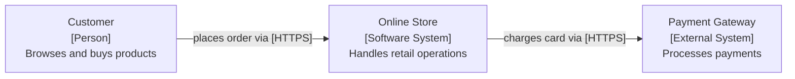

# C4 Notation

Rules for elements, relationships, and diagrams across all four C4 levels.

## The Four Levels

| Level | Name | Shows | Audience |
|-------|------|-------|----------|
| 1 | System Context | The system + who uses it + what it depends on | Everyone |
| 2 | Container | Major deployable/runnable units inside the system | Technical |
| 3 | Component | Internal structure of one container | Developers |
| 4 | Code | Classes, interfaces, functions (optional) | Developers |

Each level zooms into the previous. A container from Level 2 becomes the boundary of a Level 3 diagram.

---

## Element Definitions

**Person** -- A human user or role that interacts with the system. Not an external system.
- Label: role name (e.g., "Customer", "Admin")
- Description: one sentence on what they do

**Software System** -- An entire system, treated as a black box. Used in Level 1.
- Label: system name
- Description: one sentence on what it does

**Container** -- A separately deployable unit: web app, mobile app, database, API, queue, etc. Used in Level 2.
- Label: name + [technology] (e.g., "API Server [Node.js]")
- Description: one sentence on responsibility

**Component** -- A logical grouping within a container: controller, service, repository, etc. Used in Level 3.
- Label: name + [technology] (e.g., "Order Service [Express]")
- Description: one sentence on responsibility

**Relationship** -- A directed arrow with a label.
- Label: what is sent or what action happens (e.g., "submits order", "reads/writes", "authenticates via")
- Technology: optionally add protocol in brackets (e.g., "[HTTPS]", "[TCP/IP]", "[AMQP]")

---

## Naming Conventions

- Person names: Title Case role (Customer, Operations Team)
- System names: Title Case proper noun (Payment Gateway, Email Service)
- Container names: function + technology in brackets (Single Page App [React], API Server [Node.js])
- Component names: function + type (Order Service, User Repository, Auth Controller)
- Relationship labels: active verb phrase (reads user data from, sends notification via)

---

## Diagram Rules

1. Every element has a label and a one-sentence description. No unlabeled boxes.
2. Relationships go in one direction per arrow. No bidirectional arrows -- use two arrows if truly bidirectional.
3. Do not mix levels in one diagram. A Level 2 diagram shows containers and external systems, not components.
4. External systems appear in Level 1 and Level 2 diagrams. They are grayed out or styled differently.
5. People appear in Level 1 and optionally Level 2. They do not appear in Level 3.
6. Every diagram has a title and a key explaining shape meaning.

---

## Mermaid Format

Use `graph LR` or `graph TB` for C4 diagrams in Mermaid. Label nodes with their type.



Node shape conventions:
- Person: `[" "]` rectangle with rounded indicator in label
- Software System (internal): `[" "]` rectangle, use bold or distinct label
- Software System (external): `[" "]` rectangle with `[External System]` tag
- Container: `[" "]` with `[technology]` tag
- Component: `[" "]` with `[type]` tag

---

## Structurizr DSL Format

```dsl
workspace {
  model {
    u = person "Customer" "Browses and buys products."
    s = softwareSystem "Online Store" "Handles retail operations." {
      api = container "API Server" "Business logic." "Node.js"
      db  = container "Database" "Stores orders and users." "PostgreSQL"
    }
    p = softwareSystem "Payment Gateway" "Processes payments." "External"

    u -> s "Places order"
    s -> p "Charges card" "HTTPS"
    api -> db "Reads/writes" "SQL"
  }
}
```
