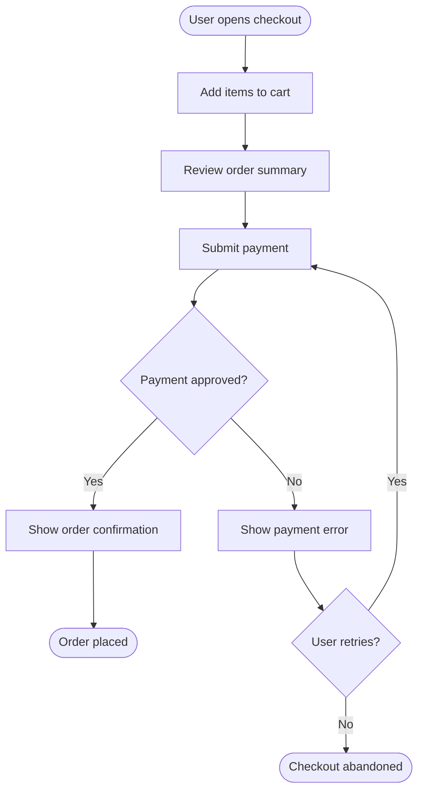
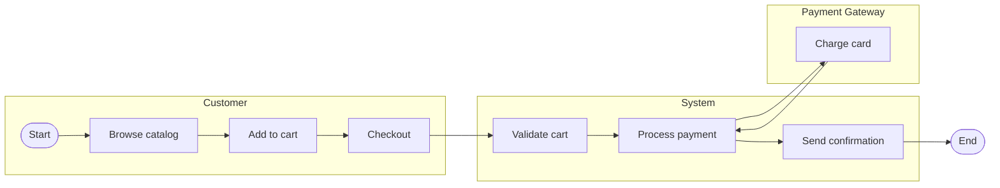

# Flow Guide

Questions and rules for capturing business processes at Stage 01b.

## Questions to Ask Per User Role

- What is the first thing this user does when they open the system?
- What is their most common task? Walk me through it step by step.
- What can go wrong at each step? How does the system respond?
- Are there tasks that require approval or involve another person?
- Are there tasks triggered automatically (scheduled jobs, external events) rather than by a user?

## Questions to Ask About the System Boundary

- Where does the user's action end and the system's action begin?
- Which steps happen in real time vs. asynchronously?
- Are there steps that involve external systems the user does not see?

## Flow Diagram Rules

1. Each swimlane represents one actor: a user role, the system, or an external system.
2. Boxes are actions or states. Diamonds are decisions.
3. Use plain language -- no class names, no API endpoint paths, no SQL.
4. Happy path flows left-to-right or top-to-bottom. Failure paths branch visibly.
5. Every flow has a start trigger and a defined end state (success or failure).
6. Do not show internal system mechanics (which container handles what). The system is a black box here.

## Mermaid Flowchart Format

## Mermaid Swimlane Format

Use subgraphs to simulate swimlanes:

## What NOT to Capture Here

- Which API endpoint handles the request
- Which database table is read or written
- Which container or service is responsible
- Error codes or HTTP status codes

These belong in Stage 03 (sequence diagrams) and Stage 03 (interface contracts).
