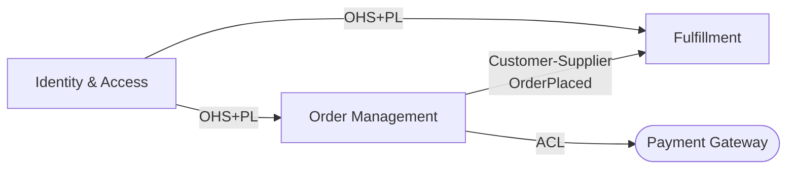

# Context Map Format

Rules and format for the `{slug}-context-map.md` artifact produced at Stage 01c.

## Relationship Types

### Customer-Supplier
Upstream BC (supplier) produces something that downstream BC (customer) consumes.
Downstream has influence over what upstream exposes -- they negotiate.
Use when: two internal BCs with a defined dependency and a team that owns each side.

### Conformist
Upstream BC produces; downstream BC consumes and must conform to upstream's model without negotiation.
Downstream adopts upstream's language wholesale.
Use when: downstream has no influence over upstream (third-party API, internal platform team that does
not take requests from consumers).

### Anti-Corruption Layer (ACL)
Downstream BC creates a translation layer that converts upstream's model into its own domain language.
Upstream's model does not leak into downstream's domain.
Use when: upstream model is legacy, poorly designed, or uses different language that would corrupt the
downstream domain model if adopted directly.

### Shared Kernel
Two BCs share a subset of the domain model (types, events, or aggregates) by explicit agreement.
Changes to the shared kernel require coordination between both teams.
Use when: two BCs are tightly coupled by a stable shared concept that neither can own independently.
Minimise use -- Shared Kernel introduces coupling.

### Open Host Service + Published Language (OHS+PL)
Upstream BC publishes a well-defined, versioned API or event schema (Published Language) available
to many consumers (Open Host Service).
Use when: one BC serves many downstream consumers and maintains a stable public contract.

### Partnership
Two BCs succeed or fail together. Teams coordinate changes mutually.
Use when: two BCs are in active co-development and cannot evolve independently.
Temporary -- aim to resolve into Customer-Supplier once interfaces stabilise.

---

## When to Require an ACL

Require ACL when ANY of these are true:
- Upstream uses different terminology for the same concept (translation needed)
- Upstream is a third-party or legacy system with an unstable or poor model
- Downstream team wants to be insulated from upstream changes
- Upstream model contains concepts that have no meaning in the downstream domain

Do NOT use ACL when:
- The downstream team controls the upstream (Customer-Supplier is better)
- The models are truly aligned and sharing language is correct (Conformist or Shared Kernel)

---

## Artifact Format

```markdown
## [BC Name A] → [BC Name B]

| Field | Value |
|-------|-------|
| Direction | Upstream: [A or B] / Downstream: [B or A] |
| Relationship Type | Customer-Supplier / Conformist / ACL / Shared Kernel / OHS+PL / Partnership |
| ACL Required | Yes / No |
| ACL Justification | [Why ACL is or is not needed] |
| Domain Events Exchanged | [EventName1, EventName2 -- or "none" if synchronous only] |
| Key Shared Concepts | [Terms that cross the boundary] |
| Notes | [Versioning, ownership, or negotiation notes] |
```

---

## Example

```markdown
## Order Management → Fulfillment

| Field | Value |
|-------|-------|
| Direction | Upstream: Order Management / Downstream: Fulfillment |
| Relationship Type | Customer-Supplier |
| ACL Required | No |
| ACL Justification | Both BCs are internal and teams negotiate the shared contract; language alignment is confirmed |
| Domain Events Exchanged | OrderPlaced, OrderCancelled |
| Key Shared Concepts | Order ID, Line Item, Delivery Address |
| Notes | Fulfillment team reviews any changes to OrderPlaced event schema before release |
```

```markdown
## Order Management → Payment Gateway [External]

| Field | Value |
|-------|-------|
| Direction | Upstream: Payment Gateway / Downstream: Order Management |
| Relationship Type | ACL |
| ACL Required | Yes |
| ACL Justification | Payment Gateway uses "Charge" and "Transaction" where our domain uses "Payment" and "Settlement"; third-party model must not leak into Order Management |
| Domain Events Exchanged | none (synchronous request/response) |
| Key Shared Concepts | Amount, Currency, Card Token (translated at ACL boundary) |
| Notes | ACL lives in a PaymentGatewayAdapter class within Order Management BC |
```

---

## Diagram Format

Use Mermaid graph to visualise the context map. Annotate each arrow with relationship type.



Legend:
- Square brackets `[ ]`: internal bounded context
- Round brackets `([ ])`: external BC / external system
- Arrow label: relationship type + key event if async
