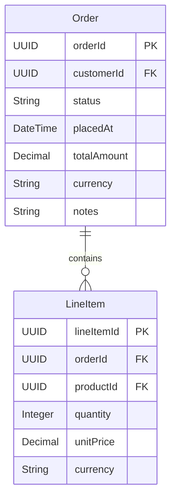

# Entity Format Reference

Format for entity attribute tables and ERD diagrams in Stage 01d output.

## Entity Attribute Table

One table block per aggregate. Structure: aggregate header, root entity table, child entity tables, value object list.

```markdown
### Aggregate: Order [Order Management BC]

**Aggregate Root:** Order

| Attribute | Type | Constraint | Description |
|---|---|---|---|
| orderId | UUID | required, unique | Aggregate identity |
| customerId | UUID | required | Reference to the placing customer |
| status | Enum(Pending, Confirmed, Shipped, Cancelled) | required | Current lifecycle state |
| placedAt | DateTime | required | When the order was placed |
| totalAmount | Money | required | Calculated sum of all line items |
| notes | String | optional, max 500 chars | Customer-provided order notes |

**Child Entity:** LineItem

| Attribute | Type | Constraint | Description |
|---|---|---|---|
| lineItemId | UUID | required, unique within Order | Identity within the aggregate |
| productId | UUID | required | Reference to the product |
| quantity | Integer | required, positive | Units ordered |
| unitPrice | Money | required, positive | Price at time of order |

**Value Objects:**

- `Money`: { amount: Decimal (required, non-negative), currency: String (required, ISO 4217) }
- `Address`: { street: String, city: String, postalCode: String, countryCode: String (ISO 3166-1 alpha-2) }
```

## ERD Diagram

Use Mermaid `erDiagram` syntax. One diagram per BC. Value objects are inlined into the parent entity.



Rules:
- `PK` marks the aggregate/entity identifier
- `FK` marks a reference to another entity (within or across BC)
- Value object fields are inlined into the parent entity — no separate box
- Relationship labels use domain verbs: "contains", "belongs to", "references", "fulfils", "initiated by"
- One `erDiagram` per BC — do not mix entities from different BCs in one diagram
- Cross-BC FKs are shown as FK in the consuming entity but the referenced entity box is not drawn (it is external)

## Cross-BC Dependency Table

```markdown
| Source BC | Data Produced | Target BC | Projection Name | Fields Included | Direction | ACL Required | Notes |
|---|---|---|---|---|---|---|---|
| Identity | User | Order Management | CustomerRef | customerId, displayName | Upstream → Downstream | No | Projection excludes credentials |
| Order Management | OrderPlaced event | Fulfillment | FulfillmentRequest | orderId, lineItems, shippingAddress | Published event | Yes | Format differs; ACL translates |
```

## Storage Hints Table

```markdown
| Aggregate | BC | Storage Type | Rationale | Candidate Technology |
|---|---|---|---|---|
| Order + LineItem | Order Management | Relational | Transactions across Order and LineItem; structured queries by status and date range | PostgreSQL |
| Catalog Item | Product | Document | Schema varies by product category; retrieved as whole object | MongoDB |
| Session | Identity | Key-Value | Lookup by token only; short TTL; no relationships | Redis |
| ActivityLog | Audit | Time-Series | Append-only timestamped events; range queries by time | TimescaleDB |
```
