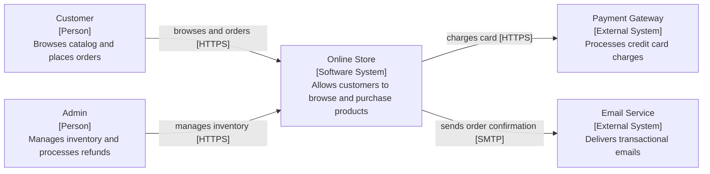

# Diagram Examples

Concrete examples of C4 Level 1 diagrams in each supported format.

## Example System

Online retail platform with: Customer user, Admin user, Payment Gateway (external), Email Service (external).

---

## Mermaid



---

## Structurizr DSL

```dsl
workspace "Online Store" "C4 Level 1 - System Context" {
  model {
    customer = person "Customer" "Browses catalog and places orders."
    admin    = person "Admin" "Manages inventory and processes refunds."

    store = softwareSystem "Online Store" "Allows customers to browse and purchase products."

    payment = softwareSystem "Payment Gateway" "Processes credit card charges." {
      tags "External System"
    }
    email = softwareSystem "Email Service" "Delivers transactional emails." {
      tags "External System"
    }

    customer -> store "Browses and orders" "HTTPS"
    admin -> store "Manages inventory" "HTTPS"
    store -> payment "Charges card" "HTTPS"
    store -> email "Sends order confirmation" "SMTP"
  }

  views {
    systemContext store "SystemContext" {
      include *
      autoLayout LR
    }
  }
}
```

---

## PlantUML C4

```plantuml
@startuml SystemContext
!include https://raw.githubusercontent.com/plantuml-stdlib/C4-PlantUML/master/C4_Context.puml

LAYOUT_LEFT_RIGHT()

Person(customer, "Customer", "Browses catalog and places orders.")
Person(admin, "Admin", "Manages inventory and processes refunds.")

System(store, "Online Store", "Allows customers to browse and purchase products.")

System_Ext(payment, "Payment Gateway", "Processes credit card charges.")
System_Ext(email, "Email Service", "Delivers transactional emails.")

Rel(customer, store, "Browses and orders", "HTTPS")
Rel(admin, store, "Manages inventory", "HTTPS")
Rel(store, payment, "Charges card", "HTTPS")
Rel(store, email, "Sends order confirmation", "SMTP")

@enduml
```
